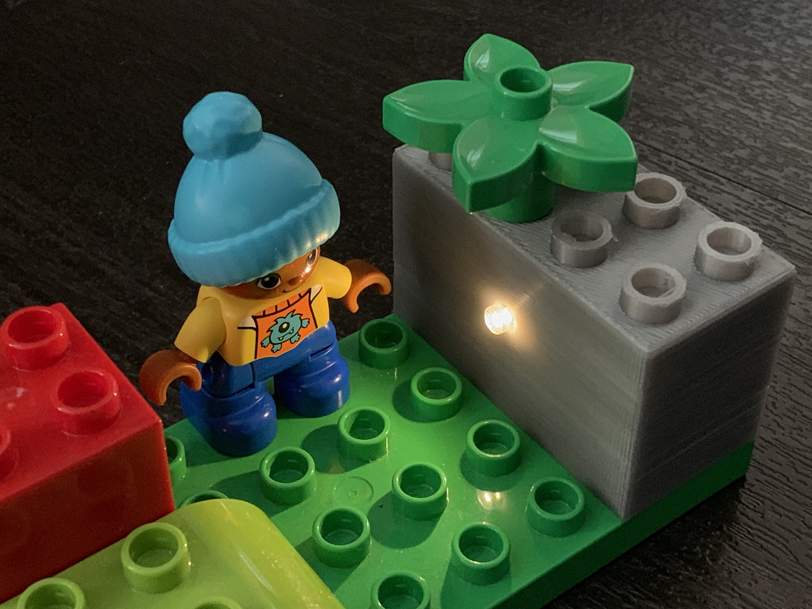
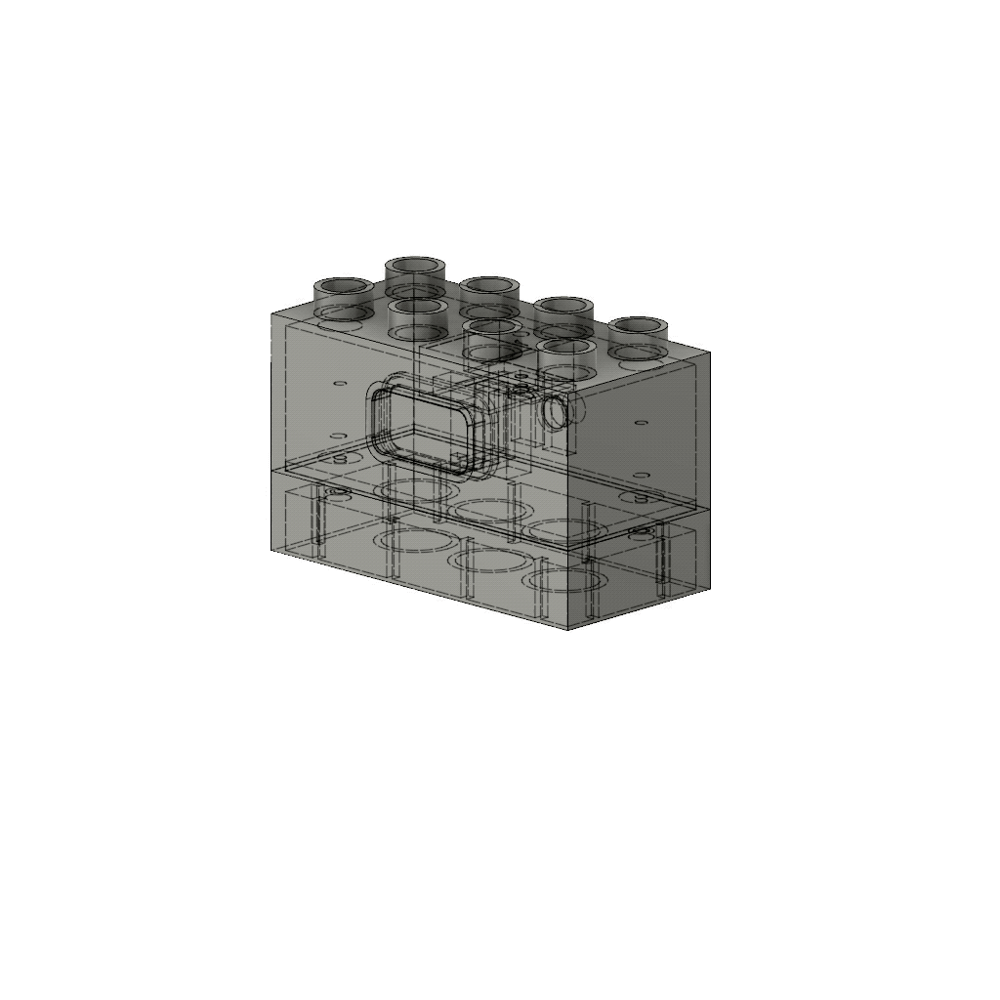
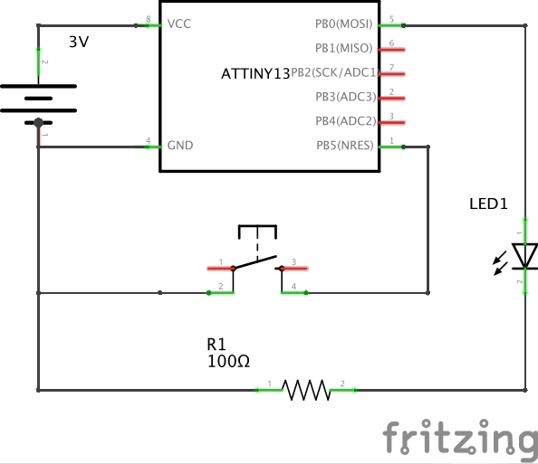
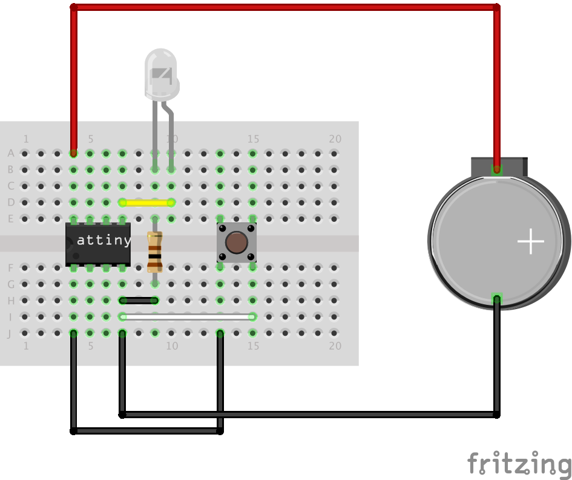
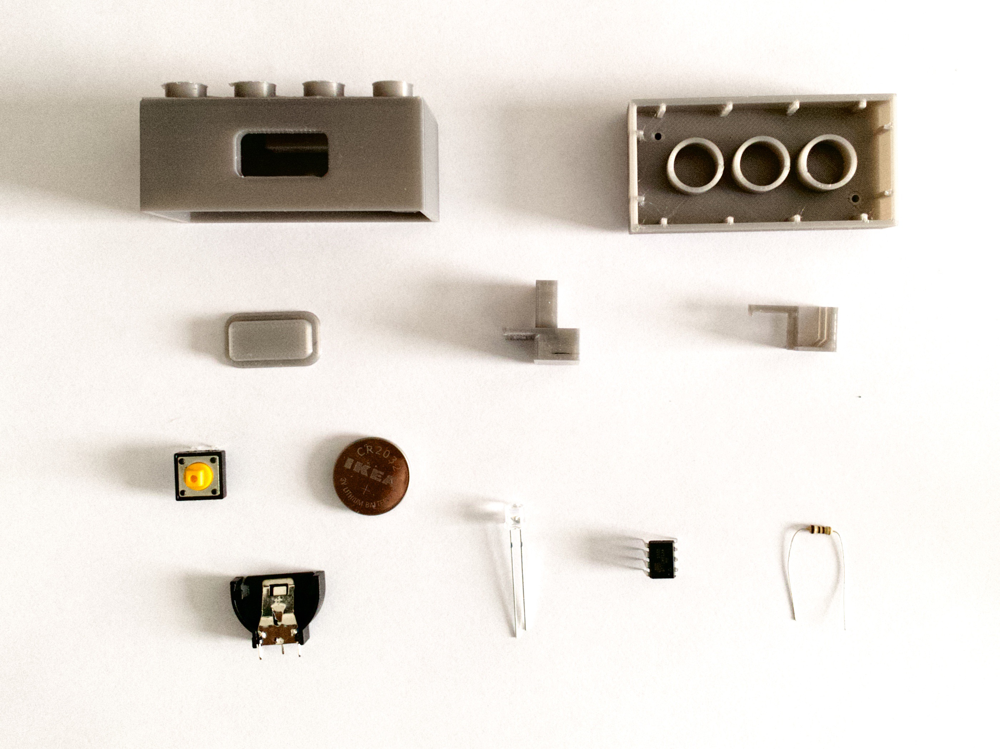
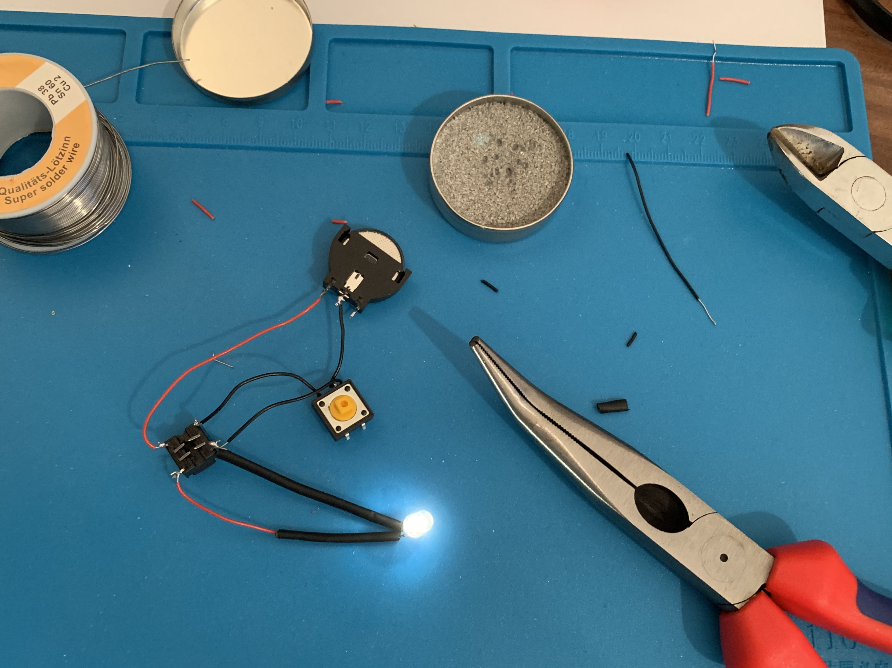
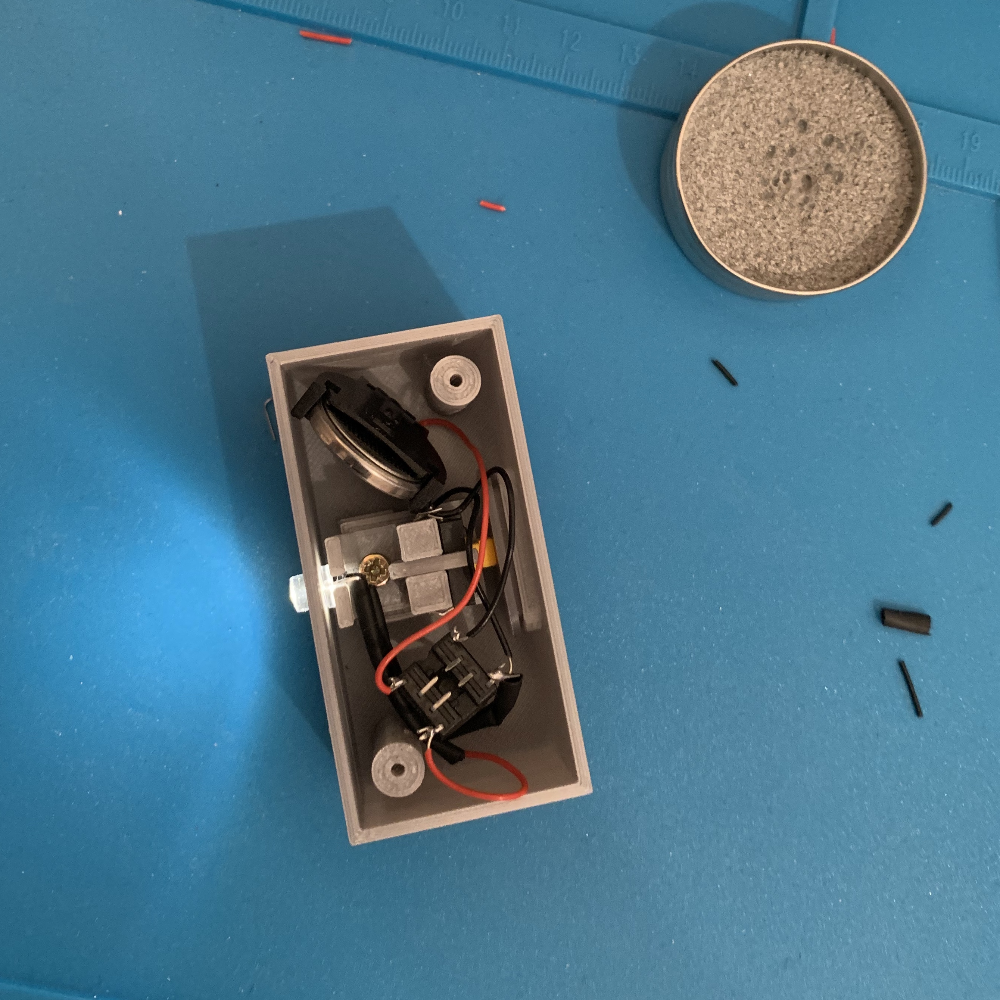
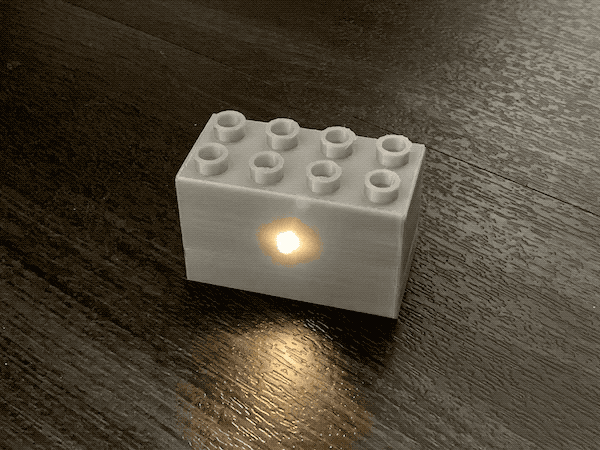

# Smart LEGO Duplo 

A couple months ago I figured out that CR2032 (3V coin battery) is small enough to fit inside a LEGO Duplo brick. Meanwhile, with my daughter, we built a Duplo house and put a small flashlight inside the have a nice atmosphere there while Lego figures having dinner. And almost immediately this question came to my mind: Can I build a Duplo brick with a LED to have the perfect light for our houses? 🤔

## My requirements

- Maximum Duplo compatibility - should be exactly (or almost) the same as a standard Duplo brick
- Durable design (because it's for children)
- The battery can be replaced
- Auto-off (children easy forget to turn it off)
- Low power consumption in standby mode

## Design 

This project was a nice opportunity to learn something new. I used TinkerCad for my previous 3D designs so I decided to level up to Fusion 360. It has a free license for hobby makers like me. Great! Invested time to learning new CAD was definitely worth because, as you can see, the brick is more complex than I thought at the beginning. 



## 3D Printing

[All STL files here](./model)

I used Prusa i3 MK3 with Verbatim PLA filament. Don't forget to print also supports because there are holes and the switch holder part is complex a bit. I recommend print all parts oriented as you can see on this photo. The top part of the brick (studs) should lay on printer's bed.   


## Electronics

The requirements were very straightforward: one button, after press it is should be lighting for a minute and then automatically switched off with minimum current consumption. I tried to figure out how to do it in some minimal way. Maybe because I'm a software developer the simplest was for me using an ATTiny13 MCU. 



Also, you should test it on a breadboard before you'll solder it together. 



## Program

[Full source code](./src)

Even the program is pretty simple: just run, set LED pin to HIGH, wait one minute and then sleep, there was a tricky part: The sleeping. You need to do a couple of things: 

```c
void enterSleep()
{
  cli(); // disable all interrupts
  WDTCR = 0; // turn off the Watchdog timer
  set_sleep_mode(SLEEP_MODE_PWR_DOWN); 
  ADCSRA &= ~(1<<ADEN); // disable ADC (ADC uses ~320uA)
  sleep_enable();
  sleep_cpu();
}
```

For uploading the program to ATTiny I used an Arduino as ISP. You can follow this [tutorial to build an ATTiny programmer](https://create.arduino.cc/projecthub/arjun/programming-attiny85-with-arduino-uno-afb829). 

## Assembling



Lets put all together. Here is the full part list: 

- All 3D printed parts: [STL files here](./model)
- ATTiny13A 
- DIP8 socket (useful for safe MCU soldering and also if you want to modify the program in the future) 
- Resistor 100Ω
- CR2032 coin battery
- Battery holder  
- Tactile Switch 12x12 mm
- White 5mm LED with big diffusion angle (I used 140°)
- 3 pcs self-tapping screw 2.5x12 mm
- Wires
- Solder, soldering paste, etc.  

Not my proudest soldering to be honest, but not great not terrible. 😄



This was a cold sweat moment because putting all together - 3D printed button, button holder (which has two parts) and the LED to such a small place - was a puzzle a bit. But the design works and it's possible to assemble it. Please do give it up too early! 😅




## Result

It works great. Look on this Duplo grandma sitting on the couch, watching TV and having a nice evening with her new shining Duplo brick. Maybe you are asking here why I'm calling it Smart LEGO Duplo. And you are right. There's nothing smart on switching on/off the LED. My idea was having a Duplo brick with a battery and MCU inside. You can replace the white LED with RGB and create Disco effects, you can replace LED with two (red and blue) and speaker and create police siren... Endless possibilities! 😍


