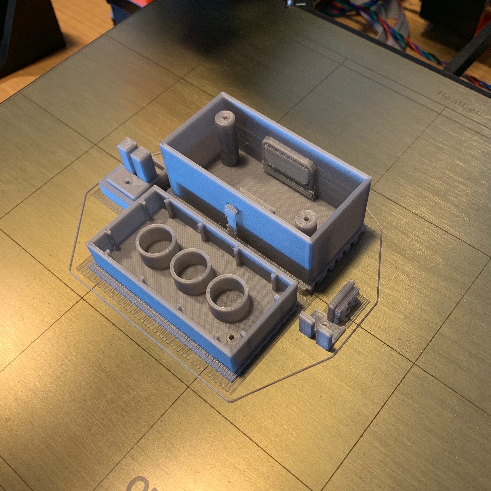

# Smart LEGO Duplo 

A couple months ago I figured out that CR2032 (3V coin battery) is small enough to fit inside a LEGO Duplo brick. Meanwhile with my daughter we built a Duplo house and put a small flashlight inside the have a nice athmosphere there while Lego figures having a dinner. And almost immediatelly this question came to my min: Can I build a Duplo brick with a LED to have perfect light for our houses? 🤔

## My requirements

- Maximum Duplo compatibility - should be exactly (or almost) the same as a standard Duplo brick
- Durable design (because it's for children)
- Battery can be replaced
- Auto off (children easy forget to turn it off)
- Low power consumption in standby mode

## Design 

This project was a nice oppurtunity to learn something new. I used TinkerCad for my previous 3D designs so I decided to level up to Fusion 360. It has free license for hobby makers as me. Great! Invested time to learning new CAD was definitely worth because, as you can see, the brick is more complex than I though at the beginning. 


## 3D Printing

[All STL files here](./model)

I used Prusa i3 MK3 with Verbatim PLA filament. Don't forget to print also supports because there are holes and the switch holder part is complex a bit. I recommend print all parts oriented as you can see on this photo. The top part of the brick (studs) should lay on printer's bed.   



## Electronics

The requirements was very streightforward: one button, after press it is should be lighting for a minute and then automatically switched off with minimum current compsumption. I tried to figure how to do it in some minimal way. Maybe because I'm software developer the simplest was for me using a ATTiny13 MCU. 


Also you should test it on a breadboard before you'll solder it together. 


## Program

[Full source code](./src)

Even the program is pretty simple: just run, set LED pin to HIGH, wait one minute and then sleep, there was a tricky part: The sleeping. You need do couple of things: 

```c
void enterSleep()
{
  cli(); // disable all interrupts
  WDTCR = 0; // turn off the Watchdog timer
  set_sleep_mode(SLEEP_MODE_PWR_DOWN); 
  ADCSRA &= ~(1<<ADEN); // disable ADC (ADC uses ~320uA)
  sleep_enable();
  sleep_cpu();
}
```

For uploading the program to ATTiny I used an Arduino as ISP. You can follow this [tutorial to build ATTiny programmer](https://create.arduino.cc/projecthub/arjun/programming-attiny85-with-arduino-uno-afb829). 

## Assembling


Lets put all together. Here is full part list: 

- All 3D printed parts: [STL files here](./model)
- ATTiny13A 
- DIP8 socket (useful for safe MCU soldering and also if you want modify the program in the future) 
- Resistor 100Ω
- CR2032 coin battery
- Battery holder  
- Tactile switch 12x12 mm
- White 5mm LED with big diffusion angle (I used 140°)
- 3 pcs self tapping screw 2.5x12 mm
- Wires
- Solder, soldering paste, etc.  

Not my proudest soldering to be honest, but not great not terrible. 😄


This was cold sweat moment because putting all together - 3D printed button, button holder (which has two parts) and the LED to such small place - was a puzzle a bit. But the design works and it's possible to assemble it. Please do give it up too early! 😅


## Result

It works great. Look on this Duplo grandma sitting on the cauch, watching TV and having nice evening with this shining Duplo brick. Maybe you are asking here why I'm call it Smart LEGO Duplo. And you are right. There's nothing smart on switch on/off the LED. My idea is having a Duplo brick with a battery and MCU inside. You can replace white LED with RGB and create Disco effects, you can replace LED with two (red and blue) and speaker and create police siren... Endless posibilities! 😍

