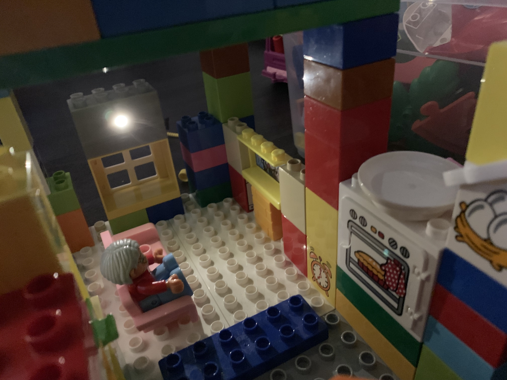

# Smart LEGO Duplo 

A few months ago, I figured out that CR2032 (3V coin battery) is little enough to fit inside a LEGO Duplo brick. In the interim, with my daughter, we built a Duplo house and put a small spotlight inside to have a pleasant atmosphere while the Lego figures have dinner. Also, very quickly, this question came to my mind: Can I build a Duplo brick with a LED to have the ideal light for our homes? 🤔

## My requirements

- Maximum Duplo compatibility - should be exactly (or almost) equivalent as a standard Duplo brick
- Durable design (since it's for children)
- Replaceable battery
- Auto-off feature (children may easily forget to turn it off)
- Low power consumption when in standby mode

## Design 

This project was a nice opportunity to gain some useful knowledge. I used TinkerCad for my previous 3D designs so, I decided to level up to Fusion 360. It has a free license for hobby makers like me. Great! Invested time to learning new CAD was definitely worth it in light of the fact that, as you can see, the brick is more complex than I thought at the onset. 


## 3D Printing

[All STL files here](./model)

I used Prusa i3 MK3 with Verbatim PLA filament. Also, remember to print the supports because there are holes and the switch holder part is somewhat complex. I recommend you print all parts oriented as you can see on this photo. The top part of the brick (studs) should lay on the printer's bed. 


## Electronics

The requirements are distinctly outlined: The power button, after press, should light for a minute and then switch off automatically with minimum power consumption. I tried to figure out how to do it in some minimal way. Perhaps in light of the fact that I'm a software developer, the least difficult, for me, was utilizing ATTiny13 MCU.  


Also, you should test it on a breadboard before soldering. 


## Program

[Full source code](./src)

Even the program is pretty simple: just run, set LED pin to HIGH, wait one minute and then sleep. There was a tricky part; The sleep mode. You need to do a couple of things: 

```c
void enterSleep()
{
  cli(); // disable all interrupts
  WDTCR = 0; // turn off the Watchdog timer
  set_sleep_mode(SLEEP_MODE_PWR_DOWN); 
  ADCSRA &= ~(1<<ADEN); // disable ADC (ADC uses ~320uA)
  sleep_enable();
  sleep_cpu();
}
```

For uploading the program to ATTiny, I used an Arduino as ISP. You can follow this [tutorial to build an ATTiny programmer](https://create.arduino.cc/projecthub/arjun/programming-attiny85-with-arduino-uno-afb829). 

## Assembling


Let’s put all together. Here is the full part list:  

- All 3D printed parts: [STL files here](./model)
- ATTiny13A 
- DIP8 socket (useful for safe MCU soldering, and also if you want to modify the program in the future) 
- Resistor - 100Ω
- CR2032 coin battery
- Battery holder  
- Tactile Switch 12x12 mm
- White 5mm LED with big diffusion angle (I used 140°)
- 3 pcs self-tapping screw 2.5x12 mm
- Wires
- Solder, soldering paste, etc.  

Not my proudest soldering to be honest, but not great, not terrible. 😄


This was a moment of cold sweat because putting all together - 3D printed button, button holder (which has two parts), and the LED to such a small place - was somewhat a puzzle. Be that as it may, the design works, and it is also possible to assemble it. Please, do not give up on it too early! 😅


## Result

The result was extraordinary. Look on this Duplo grandma sitting on the couch, watching TV, and having a nice evening with her new shining Duplo brick. Possibly, you are asking yourself why I called it a Smart LEGO Duplo. You are right! There is nothing smart on switching on/off the LED. My idea was to have a Duplo brick with a battery and MCU inside. You can replace the white LED with RGB and create Disco effects. Also, you can replace the white LED with red and blue LEDs, add a speaker and create police siren... Endless possibilities! 😍



